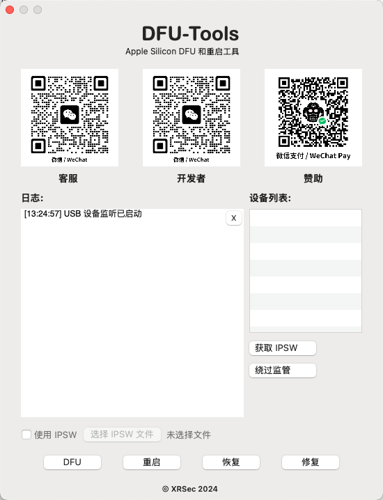

# DFU-Tools

`DFU-Tools` 是一个面向 macOS 的桌面工具，用于辅助 Apple Silicon、T2 以及部分 iPhone、iPad 设备进行 DFU、重启、恢复和修复操作。

项目主界面使用 Cocoa + Swift 编写，主工程为 `DFU-Tools.xcodeproj`。



## 功能

- 自动监听 USB 设备插拔并刷新设备列表
- 显示设备 DFU 状态、芯片类型和基础识别信息
- 支持 `DFU`、`Reboot`、`Restore`、`Revive`
- 支持手动选择 IPSW 文件
- 支持中英文界面切换
- 提供日志输出，便于定位问题

## 当前实现

- `DFU` / `Reboot` 通过 `DFUToolsHelper` Swift 分支封装的本地 helper 执行
- `Restore` / `Revive` 通过 `Apple Configurator` 自带的 `cfgutil` 执行
- 管理员密码会保存在本地配置中，便于重复使用
- 授权校验目前只保留框架，默认不启用验证逻辑

## 依赖

项目依赖 `Apple Configurator`，同时需要本地可用的 `DFUToolsHelper` 代码目录或符号链接。  
如果缺少 `Apple Configurator`，设备识别以及 `Restore` / `Revive` 将不可用。  
如果缺少 `DFUToolsHelper`，`DFU` / `Reboot` 的构建和执行将失败。

## 构建

日常使用直接执行 `make list`、`make build-debug`、`make build`、`make debug`、`make dmg` 即可。

如果需要手动构建，可以直接使用 `xcodebuild` 指定 `DFU-Tools.xcodeproj` 和 `DFU-Tools` scheme。

## 运行要求

- macOS 11.5 或更高版本
- 建议在 Apple Silicon Mac 上运行
- `DFU` / `Reboot` 需要管理员权限
- `Restore` / `Revive` 需要本机已安装 `Apple Configurator`

## 本地配置

项目会在本地保存配置文件，用于缓存管理员密码和 IPSW 路径。默认位置在：

`~/Library/Application Support/DFU-Tools.json`

## 目录

- `DFU-Tools/`：主应用源码与资源
- `DFU-Tools.xcodeproj/`：Xcode 工程
- `DFUToolsHelper/`：本地引用的 helper 源码目录或链接
- `cfgutil 数据/`：调试记录与样例数据
- `Makefile`：构建入口

## 说明

- 设备列表当前只显示真实设备，不再使用 mock 数据
- 构建阶段会自动生成并打包 `DFUToolsSocketHelper`
- 主功能已经不再依赖旧的 `macvdmtool` 子模块

### 已损坏 打不开 / Can't open

```bash
sudo xattr -rd com.apple.quarantine /Applications/DFU-Tools.app
```
